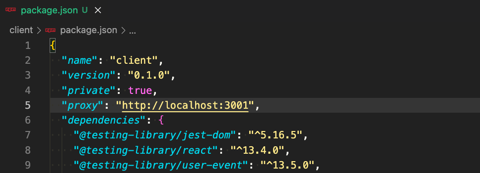
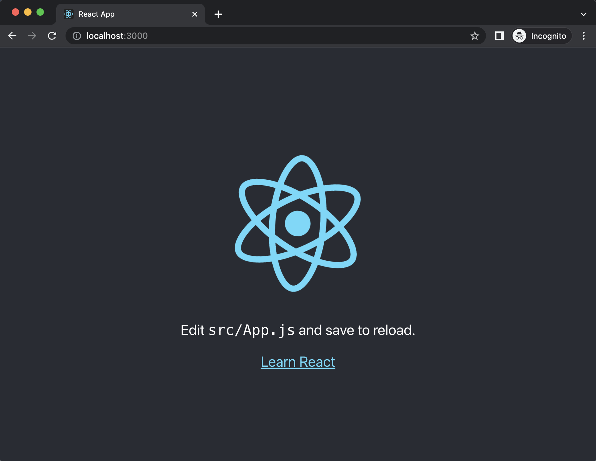

# final-project

A full stack JavaScript solo project.

## Getting Started

---

### Use this template to create a new repo on your GitHub account

1. Click green `Use this template` button, select `Create a new repository`
    1. Under `Owner` select your username
    1. Give your repoitory a name
    1. (Optional) Add a description
    1. Leave repository as `Public`
    1. **DO NOT** Include all branches
    1. Click green `Create repository from template` button

---

### Clone Newly created repo into `lfz-code` and setup `client` *(React App)*

1. From your newly created repo on GitHub, click the green `<> Code` button, then copy **SSH** URL
1. Open `lfz-code`, click on blue `><` button in bottom left of `lfz-code`
    1. Select `Clone Repository in Container Volume...`
    1. Paste **SSH** URL for your repo, click `Clone git repository from URL`
1. Create `client` *(React App)*
    1. From the terminal run `create-react-app`
        ```
        npx create-react-app client
        ```
1. Copy `.env.example` to `.env`
    ```
    cp .env.example .env
    ```
1. Open `client/package.json`, add a new line after `line 4` add the following `proxy` property
    - **NOTE:** port number should match `PORT` from the `.env` file, this is the port number your server will run on during development
    ```JSON
    "proxy": "http://localhost:3001",
    ```
    
1. Test your client
    1. In the terminal run
        ```
        npm run dev:client
        ```
    1. Your browser should open to [http://localhost:3000](http://localhost:3000) and you should see the standard starter page from `create-react-app`
        
1. Initial setup complete
    - **NOTE:** Stop the client at this point before moving onto next steps. Press <kbd>Control</kbd> + <kbd>c</kbd> in terminal to stop client

---

### Run and test full project setup with `client` and `server`

1. WIP

---

### Setup Database

1. WIP

---

### Available `npm` commands explained

All `npm` commands should be ran from project root directory, there is **NO** need to run any `npm` commands from the `client` folder. Below is an explanation of all included `npm` commands

1. `start`
    - WIP
1. `dev`
    - WIP
1. `dev:server`
    - WIP
1. `dev:client`
    - WIP
1. `build`
    - WIP
1. `db:import`
    - WIP
1. Not directly used
    1. `preinstall`
        - WIP
    1. `prepare`
        - WIP

---

## Deployment

Once you are ready deployment instructions can be found [HERE](https://lms.learningfuze.com/code-guides/Learning-Fuze/curriculum/heroku-deployment)
